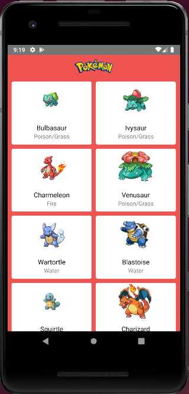

# PokemonProject

Projeto de um aplicativo desenvolvido em [react-native](https://facebook.github.io/react-native/), utilizando a API [PokéAPI](https://pokeapi.co/).

## Visão geral

O aplicativo apresenta uma lista de pokénmons extraida da API. Clicando em um dos pokémons, ele apresenta alguns detalhes do mesmo. Na tela de detalhes, ao clicar na imagem, a mesma é trocada para a imagem do pokémon de costas.

## Ambientes

Você vai precisar do npm para rodar o projeto. Não vou explicar aqui com instalá-lo por que isso vai depender do sistema operacional da sua máquina. Existem vários tutoriais na internet mostrando como fazer isso.

O app foi desenvolvido e testado em Android, numa máquina Linux/Ubuntu e no Mac (xCode 13).

Execute os comandos abaixo para preparar o ambiente:

```bach
npm install -g react-native-cli
npm install -g yarn
```

Ao fazer o download do projeto, acessar a pasta do mesmo e executar o comando abaixo para baixar as dependências:

```bach
npm install
```

### iOS

Para execução do app no iOS, deve-se acessar a pasta ios carregar os pods:

```bach
pod install
```

Em seguida, abrir o arquivo .xcworkspace no xCode e executar o app no Simulador. Para execução no Simulador, o servidor deverá ter sido executado:

```bach
yarn start
```

### Android

Para execução do app no Android, você precisa ter o AndroidStudio instalado e o ambiente configurado para uso em linha de comando.
Basicamente as variáveis de ambiente JAVA_HOME e ANDROID_HOME devem estar presentes. Se você não tem essas variáveis presentes, pesquise "setup ANDROID_HOME" e encontrará diversos posts.

Deve-se primeiramente inicializar o Emulador e em seguida executar os sequintes comandos:

```bach
yarn start
yarn android
```

Obs.: Encontra-se na pasta project-resources, um APK do app o qual pode ser instalado em dispositivos rodando Android.



## Licença de uso

[MIT](https://choosealicense.com/licenses/mit/)